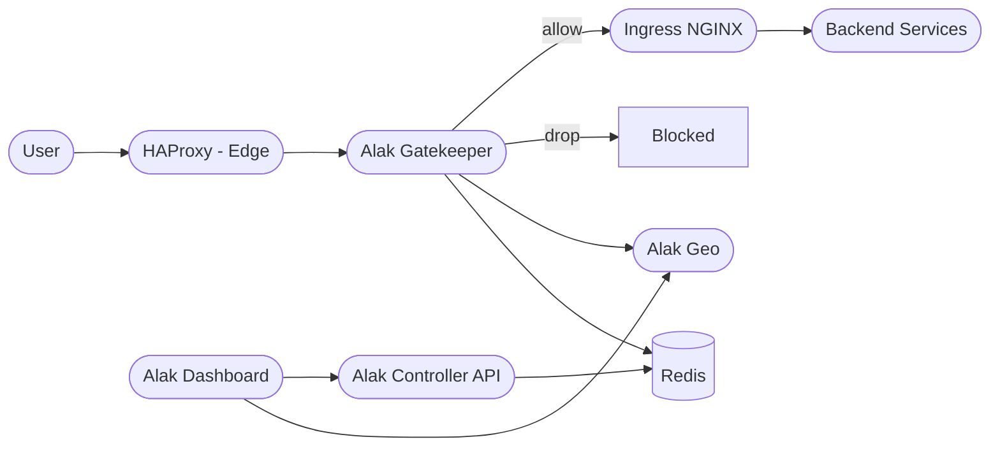
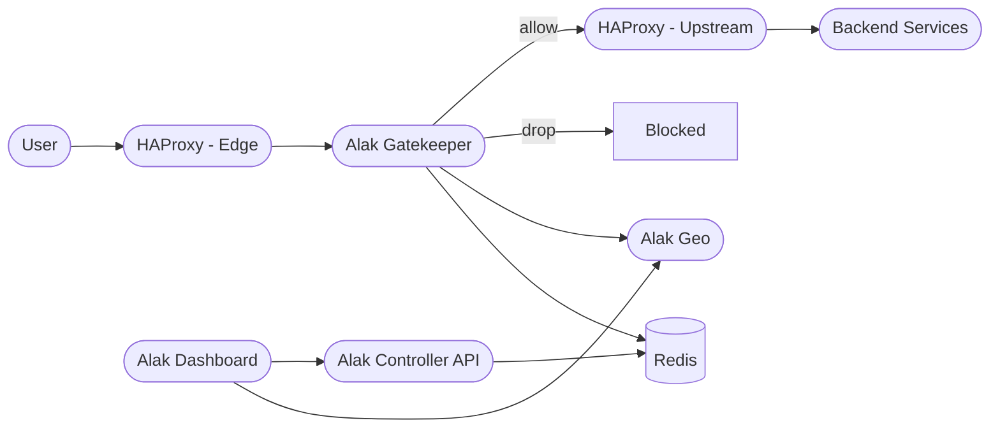

# Alak Stack

> **Production-ready load shedding, edge control, and traffic analytics with HAProxy/Ingress, Redis, GeoIP enrichment, Prometheus metrics, and a modern dashboard.**

---

## 🏗️ Architecture Overview

Alak runs in front of your apps and decides, per request, whether to **allow** or **drop** traffic based on dynamic rules (ASN, TSP/ISP, country, etc.).

Two supported upstream topologies:

### A) Edge HAProxy → Gatekeeper → **Ingress NGINX** → Services



### B) Edge HAProxy → Gatekeeper → **Upstream HAProxy** → Services



> Choose A or B per environment by setting **`HA_PROXY_URL`** (see below). Gatekeeper preserves the original `Host` and sets SNI for TLS when talking to HTTPS upstreams.

---

## 🚀 Quickstart with Docker Compose

### Prerequisites

* [Docker](https://www.docker.com/) & [Docker Compose](https://docs.docker.com/compose/)
* Download [MaxMind GeoLite2 datasets](https://dev.maxmind.com/geoip/geolite2-free-geolocation-data)

  * Place under `alak-geo/geoip/`:

    * `GeoLite2-ASN-Blocks-IPv4.csv`
    * `GeoLite2-City-Blocks-IPv4.csv`
    * `GeoLite2-ASN.mmdb`
    * `GeoLite2-City.mmdb`

### Folder structure

```
alak-stack/
├── docker-compose.yml
├── haproxy.cfg
├── alak-gatekeeper/
│   ├── main.go, go.mod, go.sum, Dockerfile
├── alak-geo/
│   ├── main.go, go.mod, go.sum, Dockerfile
│   └── geoip/
├── alak-controller/
│   ├── main.go, go.mod, go.sum, Dockerfile
├── alak-dashboard/
│   ├── Dockerfile, next.config.js, package.json, ...
```

### Start all services
```bash
docker compose up -d --build
```

* **Gatekeeper**: [http://localhost:8090](http://localhost:8090)
* **Dashboard**: [http://localhost:3000](http://localhost:3000)
* **HAProxy (edge)**: [http://localhost:80](http://localhost:80)
* **Geo API**: [http://localhost:8081/lookup](http://localhost:8081/lookup)
* **Controller API**: [http://localhost:8080](http://localhost:8080)
* **Redis**: redis\://localhost:6379

---
## ☸️ Deploy with Helm
You can deploy the stack (or just Gatekeeper) via the bundled Helm chart.

### Install
From the repo root:
```bash
kubectl create ns alak || true
helm upgrade --install alak charts/alak-stack \
  -n alak \
  -f charts/values-stage.yaml
```
> Keep separate values per environment, e.g. values-stage.yaml, values-prod.yaml.
---

## ⚙️ Configuration & Environment Variables

### Gatekeeper

* `PORT`            — listen port (default `8090`)
* `REDIS_HOST`      — host\:port (default `alak-redis:6379`)
* `ALAK_GEO_URL`    — Geo enrichment URL (default `http://alak-geo:8081/lookup`)
* `HA_PROXY_URL`    — **Upstream base URL** Gatekeeper proxies to:

  * **Topology A (Ingress):** `https://ingress-nginx-controller.ingress-nginx:443`
  * **Topology B (Upstream HAProxy):** `http://haproxy-upstream.svc.cluster.local:80`
* `SKIP_TLS_VERIFY` — `true|false` (default `true`). Set `false` once you mount the CA that signed your upstream certs.
* `ALAK_SNI_OVERRIDE` — optional hostname to force SNI (debugging only).

**Healthcheck**

* Gatekeeper serves `GET /healthz` **locally** (not proxied). Point HAProxy checks here:

  ```haproxy
  option httpchk GET /healthz
  ```

**Redirect Handling**

* Gatekeeper does **not follow** upstream redirects. 3xx responses (e.g., OIDC/Dex) are returned to the client for the browser to follow.

**Streaming (SSE/Watch) Handling**

* Requests whose path matches `/api/v1/stream/` or `Accept: text/event-stream` use a dedicated client with \*\*no \*\***`ResponseHeaderTimeout`** and long-lived context.
* For streaming through Ingress add annotations on the streaming ingress:

  ```yaml
  nginx.ingress.kubernetes.io/proxy-buffering: "off"
  nginx.ingress.kubernetes.io/proxy-request-buffering: "off"
  nginx.ingress.kubernetes.io/proxy-read-timeout: "3600"
  nginx.ingress.kubernetes.io/proxy-send-timeout: "3600"
  nginx.ingress.kubernetes.io/keepalive: "on"
  ```

### HAProxy (Edge) → Gatekeeper (common)

Minimal, production-ready defaults:

```haproxy
global
  log stdout format raw local0
  maxconn 4096
  tune.bufsize 131072
  tune.maxrewrite 8192

defaults
  log global
  mode http
  option httplog
  option http-keep-alive
  option http-buffer-request
  option redispatch
  retries 2
  timeout http-request 30s
  timeout connect 5s
  timeout client 60s
  timeout server 75s
  timeout http-keep-alive 10s
  timeout tunnel 1h
  # Rich timing logs
  log-format  "%ci:%cp [%t] %ft %b/%s %TR/%Tw/%Tc/%Tr/%Tt %ST %B %tsc %ac/%fc/%bc/%sc/%rc %sq %bq {%HM %HV} {%hr} {%hs}"

frontend fe_main
  bind :80
  bind :443 ssl crt /etc/haproxy/ssl
  option forwardfor
  http-request set-header X-Forwarded-Proto https if { ssl_fc }
  http-request set-header X-Forwarded-Proto http  if !{ ssl_fc }
  http-request set-header X-Forwarded-Host %[req.hdr(Host)]
  default_backend be_gatekeeper

backend be_gatekeeper
  balance roundrobin
  http-reuse always
  option httpchk GET /healthz
  http-check expect rstatus (2|3)..
  default-server inter 2s rise 2 fall 3 maxconn 500
  server gatekeeper alak-gatekeeper.alak.svc.cluster.local:8090 check
```

### Upstream choice per environment

* **Env with Ingress NGINX (Topology A):**

  * `HA_PROXY_URL=https://ingress-nginx-controller.ingress-nginx:443`
  * Keep SNI = original `Host`; set `SKIP_TLS_VERIFY=false` after mounting CA for `*.yourdomain.com`.
* **Env with Upstream HAProxy (Topology B):**

  * `HA_PROXY_URL=http://haproxy-upstream.svc.cluster.local:80` (HTTP inside cluster)
  * If you require TLS to upstream HAProxy, use `https://...:443` and ensure certs match your public hostnames or mount CA.

> Gatekeeper always preserves `Host` and sets `X-Forwarded-Proto`/`X-Forwarded-Host`. For HTTPS upstreams it injects **SNI = Host**.

---

## 📊 Metrics

* Prometheus at `http://<gatekeeper-host>:8090/metrics`
* Custom counters:

  * `alak_requests_total{asn,country,tsp}`
  * `alak_drops_total{asn,country,tsp}`

> When using Thanos/Grafana, prefer `rate()` with a dashboard **rate interval variable** and handle sparse series by zooming time range or using `clamp_min()` where appropriate.

---

## 🧪 Testing

Simulate traffic:

```bash
curl -v -H "X-Forwarded-For: 5.112.192.1" -H "Host: api.example.com" http://localhost:8090/v1/ping
```

Ingress host routing from inside the cluster:

```bash
kubectl -n ingress-nginx run curl --rm -it --image=curlimages/curl:8.8.0 -- \
  sh -lc 'curl -skI https://ingress-nginx-controller.ingress-nginx/health -H "Host: api.example.com"'
```

---

## 🔐 Fail-Open Policy

* **Geo down** → allow requests, log `[FAIL-OPEN]`
* **Redis down** → allow requests, log `[FAIL-OPEN]`
* **Upstream errors** → return `502` to caller, log `[PROXY ERROR]`

---

## 🛠️ Manual Build

Build a single service:

```bash
cd alak-gatekeeper
go build -o alak-gatekeeper .
./alak-gatekeeper
```

Build all images:

```bash
docker compose build
```

---

## ⚠️ Known Gotchas & Debugging

* `host="" sni=""` on `/healthz`: ensure `/healthz` is **local** in gatekeeper and HAProxy checks it.
* `net/http: timeout awaiting response headers` on `/api/v1/stream/...`: ensure stream client is selected and Ingress buffering/timeouts are tuned (see above).
* Redirect loops / DNS inside cluster for public hosts: gatekeeper **does not follow redirects**; it returns 3xx to the client to avoid in-cluster DNS issues.
* Certificate errors to HTTPS upstreams: use `SKIP_TLS_VERIFY=true` temporarily; long term mount the CA and set `SKIP_TLS_VERIFY=false`.

---

## 🤝 Contributing

1. Fork and branch.
2. Run `go mod tidy` before PRs.
3. Document big changes.
4. PRs and issues welcome!

---

## 📄 License

MIT

---

## 💬 Support

* GitHub Issues: `https://github.com/your-org/alak-stack/issues`
* Team contact / maintainer channel

---

*Built with ❤️ for modern edge and traffic management.*
