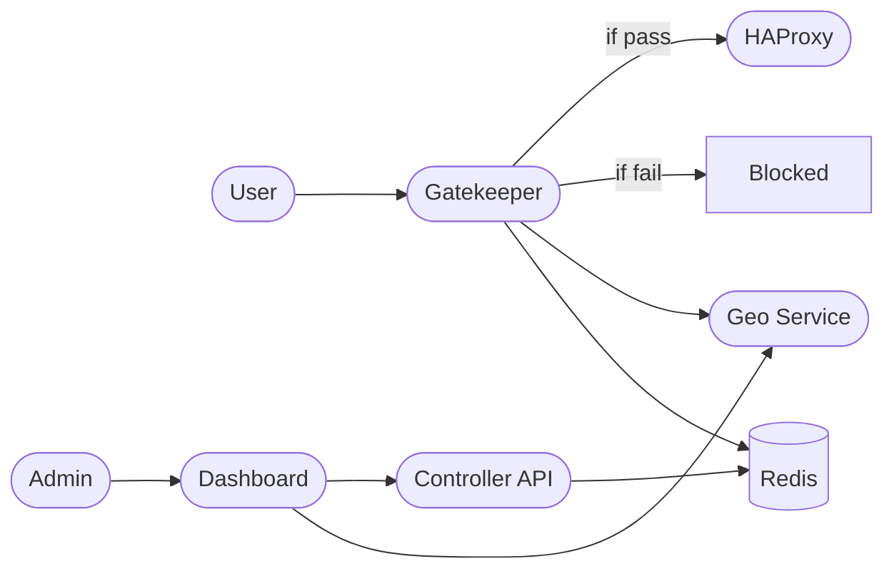

# Alak Stack

> **Production-ready load shedding, edge control, and traffic analytics with HAProxy, Redis, GeoIP enrichment, Prometheus metrics, and a modern dashboard.**

---

## 🏗️ Architecture Overview



- **HAProxy**: Edge proxy/load balancer.
- **Alak Gatekeeper**: Reverse proxy and traffic filter (dynamic rules by ASN, TSP, country, etc).  
  - If pass → sent to HAProxy  
  - If fail → dropped (not sent to HAProxy)
- **Alak Geo**: Enriches requests with ASN/TSP/country/city via MaxMind GeoIP (IPv4).
- **Redis**: Centralized rule store.
- **Alak Controller**: API for CRUD/load-shedding rules, stores rules in Redis.
- **Alak Dashboard**: Next.js admin UI for rule management and analytics.
- **Admin**: Operates via dashboard.

---

## 🚀 Quickstart with Docker Compose

### Prerequisites
- [Docker](https://www.docker.com/) & [Docker Compose](https://docs.docker.com/compose/)
- Download [MaxMind GeoLite2 CSV datasets](https://dev.maxmind.com/geoip/geolite2-free-geolocation-data)
    - Place these files in `alak-geo/geoip/`:
        - `GeoLite2-ASN-Blocks-IPv4.csv`
        - `GeoLite2-City-Blocks-IPv4.csv`
        - `GeoLite2-ASN.mmdb`
        - `GeoLite2-City.mmdb`

### Folder structure
```
alak-stack/
├── docker-compose.yml
├── haproxy.cfg
├── alak-gatekeeper/
│   ├── main.go, go.mod, go.sum, Dockerfile
├── alak-geo/
│   ├── main.go, go.mod, go.sum, Dockerfile
│   └── geoip/
├── alak-controller/
│   ├── main.go, go.mod, go.sum, Dockerfile
├── alak-dashboard/
│   ├── Dockerfile, next.config.js, package.json, ...
```

### Start all services
```bash
docker compose up -d --build
```
- **Gatekeeper**: [localhost:8090](http://localhost:8090)
- **Dashboard**: [localhost:3000](http://localhost:3000)
- **HAProxy**: [localhost:80](http://localhost:80)
- **Geo enrichment API**: [localhost:8081/lookup](http://localhost:8081/lookup)
- **Controller API**: [localhost:8080](http://localhost:8080)
- **Redis**: [localhost:6379](redis://localhost:6379)

---

## 🛠️ Manual Build

To build a single service (e.g., gatekeeper):

```bash
cd alak-gatekeeper
go build -o alak-gatekeeper .
./alak-gatekeeper
```

To build all Docker images:

```bash
docker compose build
```

---

## ⚙️ Configuration & Environment Variables

- `REDIS_HOST`   - Host:port for Redis (default: `alak-redis:6379`)
- `ALAK_GEO_URL` - URL for Geo enrichment (default: `http://alak-geo:8081/lookup`)
- `HA_PROXY_URL` - URL for HAProxy backend (default: `http://haproxy:80`)

Edit `docker-compose.yml` and `haproxy.cfg` as needed for your environment.

---

## 📊 Metrics

Prometheus metrics at `http://localhost:8090/metrics` (alak-gatekeeper).

---

## 🧪 Testing

Use curl to simulate traffic from various IPs/ASNs:
```bash
curl -v -H "X-Forwarded-For: 5.112.192.1" http://localhost:8090/
```

---

## 🔐 Fail Open Policy

If Redis or Geo enrichment is unavailable, **gatekeeper "fails open"**—all requests are allowed (not blocked), with clear logs for observability.

---

## 🤝 Contributing

1. Fork and branch for your feature/bug.
2. Run `go mod tidy` before PRs for Go code.
3. Keep code idiomatic and document big changes.
4. PRs and issues are welcome!

---

## 📄 License

[MIT License](LICENSE)

---

## 💬 Support

- Open [GitHub Issues](https://github.com/your-org/alak-stack/issues)
- Or reach out to your team or maintainer!

---

*Built with ❤️ for modern edge and traffic management.*